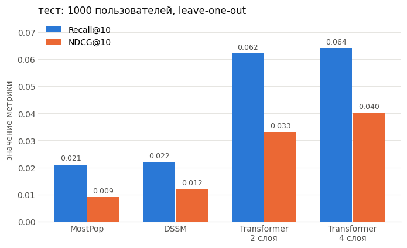

# Generative Retrieval для sequential-рекомендаций: RQ-VAE + decoder-only Transformer

Генеративный подход к рекомендациям по мотивам [TIGER](https://arxiv.org/abs/2305.05065) (Rajput et al., NeurIPS 2023), реализованный с нуля на PyTorch. Каждый товар кодируется короткой последовательностью дискретных семантических ID (RQ-VAE над эмбеддингами описаний), а decoder-only трансформер по истории пользователя генерирует ID следующего товара, вместо поиска ближайших векторов, как в two-tower моделях.

Датасет: Amazon Reviews 2023, категория Video Games.

## Результаты

Тест: leave-one-out, 1000 пользователей, одна и та же выборка для всех моделей. Эпохи и гиперпараметры выбирались по валидации, тест посчитан один раз.

| Модель | Recall@5 | Recall@10 | NDCG@10 | Recall@50 | Recall@100 | NDCG@100 |
|---|---|---|---|---|---|---|
| MostPop | 0.007 | 0.021 | 0.009 | 0.058 | 0.089 | 0.022 |
| DSSM (two-tower) | 0.015 | 0.022 | 0.012 | 0.079 | 0.131 | 0.032 |
| RQ-VAE + Transformer, 2 слоя | 0.040 | 0.062 | 0.033 | 0.126 | 0.185 | 0.056 |
| **RQ-VAE + Transformer, 4 слоя** | **0.049** | **0.064** | **0.040** | **0.156** | **0.208** | **0.068** |

По сравнению с DSSM генеративная модель примерно в 3.3 раза лучше по NDCG@10, в 2.9 раза по Recall@10 и в 1.6 раза по Recall@100. Итоговая модель 4-слойная, она выиграла на валидации (см. раздел про эксперимент ниже).

## Ноутбуки

1. [`01_data_preparation_final`](01_data_preparation_final.ipynb) - PySpark: 5-core фильтрация, дедупликация, последовательности пользователей, leave-one-out split, эмбеддинги описаний товаров через all-MiniLM-L6-v2
2. [`02_rq_vae_final`](02_rq_vae_final.ipynb) - RQ-VAE: эмбеддинг товара -> семантический ID из 3 кодов по 256
3. [`03_generative_transformer_final`](03_generative_transformer_final.ipynb) - decoder-only трансформер, который по кодам истории предсказывает коды следующего товара, на инференсе beam search с ограничением по префиксному дереву
4. [`04_dssm_baseline_final`](04_dssm_baseline_final.ipynb) - two-tower baseline на обычных ID товаров
5. [`05_deeper_transformer_experiment`](05_deeper_transformer_experiment.ipynb) - итоговая модель: 4 слоя и новый рецепт обучения, сравнивается с 2-слойной моделью из `03`

## Данные

- Amazon Reviews 2023, Video Games, обработка на PySpark
- итеративная 5-core фильтрация, между итерациями план запроса сбрасывается через запись в parquet, иначе Spark падает по памяти
- дедупликация: пользователи иногда оставляют несколько отзывов на один товар, оставлено самое раннее взаимодействие
- пользователи с историей меньше 5 товаров отброшены
- итог: около 830K взаимодействий, 95 268 пользователей, 26 354 товара
- leave-one-out: `train_hist` -> `val` (предпоследний товар) -> `test` (последний)
- контент товара: title + features + description, обрезка до 1000 символов (окно MiniLM - 256 токенов), эмбеддинги `all-MiniLM-L6-v2`, 384d

## Семантические ID (RQ-VAE)

Encoder 384 -> 256 -> 32 (+ LayerNorm), residual quantizer из 3 уровней по 256 кодов, decoder 32 -> 256 -> 384. Каждый следующий уровень квантует остаток предыдущего. Loss: reconstruction (MSE) + codebook loss + β · commitment loss (β = 0.1), градиент через `argmin` проходит по straight-through estimator.

Первая версия давала низкий loss, но все товары получали один и тот же код (1 из 256 на каждом уровне). Помогла переинициализация неиспользуемых кодов после каждой эпохи случайными реальными остатками из батча.

| Метрика | Значение |
|---|---|
| Уникальных полных ID | 25 303 из 26 354 (коллизии 4.0%) |
| Заполненность кодов по уровням | 256 / 241 / 142 из 256 |
| Косинусная близость описаний: одинаковый 1-й код / разный | 0.479 / 0.200 |

Последняя строка - проверка, что ID действительно семантические: товары с общим первым кодом заметно ближе по содержанию, чем случайные пары.

Повторное обучение с другой случайной инициализацией дает другие коды, но то же качество (4.1% коллизий, 256 / 238 / 150, близость 0.476 / 0.200). Трансформер обучен на ID из основного прогона (таблица выше), в `02_rq_vae_final` сохранены выводы повторного.

## Трансформер

- decoder-only, d_model 256, 2 слоя, 4 головы, Pre-LN, FFN с GELU (d_ff = 4 · d_model), dropout 0.1
- RoPE для позиционного кодирования
- у каждого уровня кода своя таблица эмбеддингов и своя выходная голова
- контекст - последние 42 товара (126 токенов, покрывает 99-й перцентиль длины истории)
- обучение: next-token prediction, cross-entropy без учета паддинга, Adam (lr 3e-3 для эмбеддингов, 1e-3 для остального)
- инференс: beam search с ограничением по префиксному дереву (Trie), модель генерирует только существующие комбинации кодов

Выбор эпохи: модель обучалась до 150 эпох с сохранением чекпоинтов. На валидации из 5000 пользователей эпоха 50 лучше эпохи 110 (Recall@10 0.068 против 0.061), хотя train loss продолжал снижаться, то есть дальше модель переобучается. Выбрана эпоха 50.

Ширина луча (валидация, 5000 пользователей): 10 -> Recall@10 0.064, 30 -> 0.068, 100 -> 0.068. Луча 30 достаточно, это примерно втрое меньше прогонов модели без потери качества.

Где модель ошибается - ранг правильного кода среди допустимых продолжений при известном правильном префиксе (teacher forcing, тест):

| Уровень | Кандидатов в среднем | Ранг модели | Ранг при случайном выборе | Top-1 |
|---|---|---|---|---|
| 1-й код | 256 | 59.2 | 128.5 | 4.1% |
| 2-й код | 71.8 | 14.7 | 36.4 | 18.8% |
| 3-й код | 2.6 | 1.29 | 1.78 | 81.8% |

Основная сложность в первом коде: это выбор "района" каталога без подсказки. Третий код почти всегда выбирается из 2-3 вариантов и по сути только различает близкие товары.

## Эксперимент: более глубокая модель

Изменения относительно основной модели: 4 слоя вместо 2, dropout 0.2, AdamW (weight decay 0.01, у эмбеддингов без него), warmup 3 эпохи + cosine decay, 60 эпох. Лучшая эпоха по валидации (2000 пользователей, проверка каждые 10 эпох) - 30-я: Recall@10 0.0885 против 0.0735 у основной модели на той же выборке. После 30-й эпохи эта модель тоже начинает переобучаться.

На тесте 4-слойная модель лучше по всем метрикам, кроме Recall@10, где разница в пределах погрешности (0.064 против 0.062). Сильнее всего выросли NDCG (+21% и на @10, и на @100) и Recall@50 / @100 (+3.0 и +2.3 п.п.).

Попадания по уровням (тест, teacher forcing, среди допустимых по Trie кодов):

| Уровень | Top-1, 2 слоя | Top-1, 4 слоя | Top-10, 2 слоя | Top-10, 4 слоя | Средний ранг, 2 слоя | Средний ранг, 4 слоя |
|---|---|---|---|---|---|---|
| 1-й код | 4.1% | 6.0% | 27.0% | 27.6% | 59.2 | 55.0 |
| 2-й код | 18.8% | 20.4% | 59.3% | 64.2% | 14.7 | 13.2 |
| 3-й код | 81.8% | 83.2% | 99.8% | 100% | 1.29 | 1.27 |

Улучшение есть на всех трех уровнях. Но одновременно поменялись и глубина, и рецепт обучения (регуляризация, оптимизатор, расписание lr), так что вклад каждого пока не разделен.

## Baseline: DSSM

Two-tower: user tower - average pooling эмбеддингов истории + MLP, item tower - MLP, in-batch negatives. Обучающие примеры - все префиксы `train_hist`, dropout 0.2, weight decay 1e-5, early stopping по медианному рангу на валидации.

Почему DSSM слабее: усреднение истории теряет порядок (следующая покупка сильнее всего связана с последней), у редких товаров плохо обученные ID-эмбеддинги, а in-batch negatives без logQ-поправки смещают модель против популярных товаров.

## Отладка

Первая версия генеративной модели давала метрики на уровне случайного угадывания (Recall@100 = 0.005), и поначалу я списывал это на нехватку данных и вычислений. Проверка пайплайна по частям нашла две ошибки:

1. Перемешанные ID. Семантические ID сохранялись из `DataLoader` с `shuffle=True`, поэтому строка `i` в файле соответствовала случайному товару. Коллизии и заполненность кодов от порядка не зависят, так что по ним RQ-VAE выглядел исправным. Нашлось сравнением с ID, пересобранными по порядку: совпала 1 строка из 26 354.
2. Обучение не совпадало с инференсом. Таргет сдвигался на целый товар (3 токена): каждая позиция училась предсказывать код того же уровня у следующего товара, а beam search читал логиты как next-token. Нашлось оценкой старого чекпоинта на "его" позициях: средние ранги 103 / 81 / 50 вместо примерно 128.

После исправления Recall@100 вырос с 0.005 до 0.185.

Отдельно проверено, что эмбеддинги описаний выровнены с номерами товаров: пересчет совпал с сохраненным файлом построчно (cos > 0.99 для всех строк).

## Ограничения

- 4.5% тестовых товаров недостижимы: они делят семантический ID с другим товаром, и Trie всегда возвращает другой. В TIGER это решается дополнительным токеном-разделителем
- оценка на 1000 пользователях, погрешность Recall@10 около +-1.5 п.п.
- дедупликация сделана после k-core, поэтому свойство 5-core для части товаров нарушено
- один датасет, одна категория
- DSSM - простой бейзлайн без учета последовательности

## Что дальше

- контрольный прогон "2 слоя + новый рецепт обучения", чтобы отделить вклад глубины от регуляризации и расписания lr, по результату - 6 слоев или больший `d_model`
- SASRec как бейзлайн (трансформер над ID товаров без семантических кодов): покажет, сколько дает именно семантический ID, а сколько учет порядка
- коллаборативная регуляризация RQ-VAE по мотивам [LETTER](https://arxiv.org/abs/2405.07314): собирать под одним первым кодом товары, которые пользователи берут вместе, - должно помочь на самом сложном уровне
- токен-разделитель для коллизий

## Запуск

Ноутбуки рассчитаны на Google Colab (GPU) и данные в Google Drive, пути задаются в первых ячейках. Порядок: `01` -> `02` -> `03` -> `05`, `04` можно запускать сразу после `01`.
